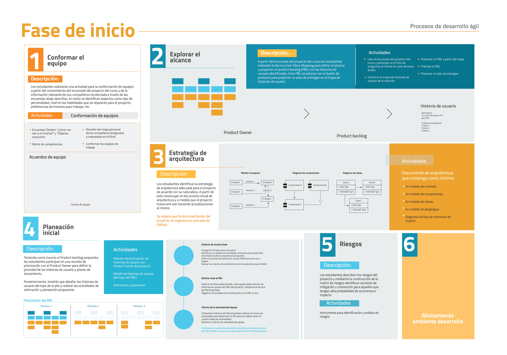
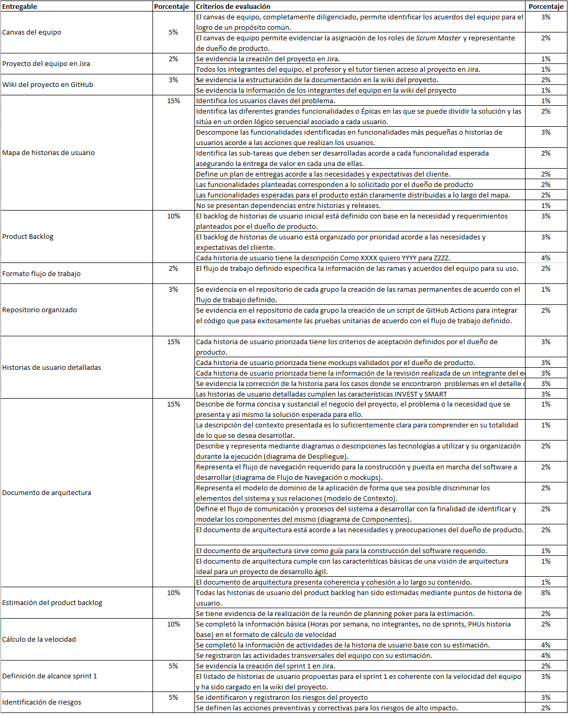

## Fase de inicio

### Descripción
---

A continuación podrá encontrar una hoja de ruta con las actividades a desarrollar durante la Fase de inicio del proyecto del curso.
 

### Detalle de objetivos y actividades por semana
---
 

| Semana |             |
|--------|-------------|
| 2      | [Ver detalle](../semana2/semana2) |
| 3      | [Ver detalle](../semana3/semana3) |

### Entregables y criterios de evaluación
---
 

