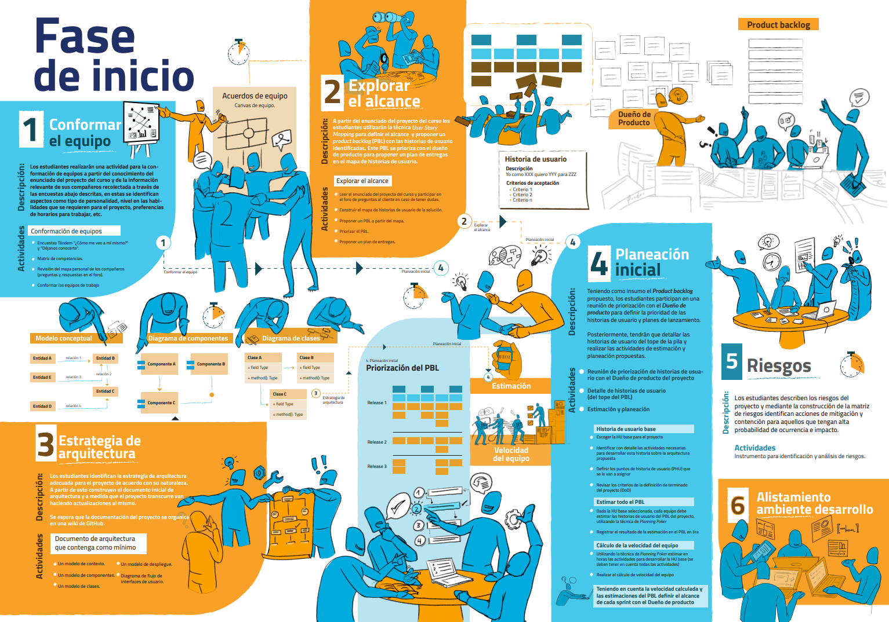

## Fase de inicio

### Descripción
---

A continuación podrá encontrar una hoja de ruta con las actividades a desarrollar durante la Fase de inicio del proyecto del curso.
 

 

<table>
  <thead>
    <tr>
      <th colspan="2" class="tg-0lax">Detalle de objetivos y actividades por semana</th>
    </tr>
  </thead>
  <tbody>
    <tr>
      <td>Semana 2</td>
      <td>
        <a href="{{ '/semanas/inception/semana2/semana2' | absolute_url }}">Ver detalle</a>
      </td>
    </tr>
    <tr>
      <td>Semana 3</td>
      <td>
        <a href="{{ '/semanas/inception/semana3/semana3' | absolute_url }}">Ver detalle</a>
      </td>
    </tr>
  </tbody>
</table>

### Entregables y criterios de evaluación
---
 

