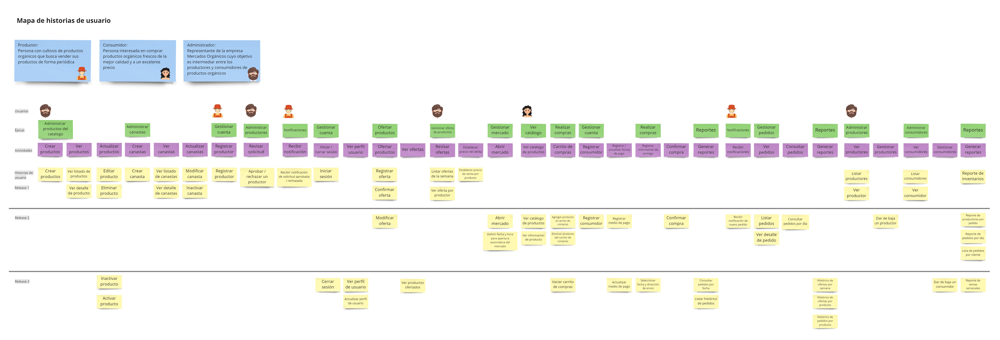
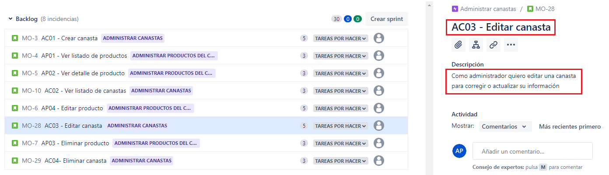

## Elaboración de la visión del producto: Ejemplo

A continuación, podrá encontrar un ejemplo de la elaboración de la visión del producto para el caso de Mercados Orgánicos.

### Primer paso. Entrevista con el dueño de producto
---
 
El siguiente dialogo corresponde a la transcripción de la conversación entre Ramiro, dueño de Mercados Orgánicos y Sara, analista de negocio de la empresa de software contratada para desarrollar el sitio web de la empresa. 

 
**SARA:** Hola Ramiro, gracias por invitarnos a participar en este proyecto. Nos gustaría aprovechar este espacio para conocer un poco más sobre Mercados Orgánicos y la principal motivación al contactarnos.

**RAMIRO:** Hola Sara, claro que sí. Mercados Orgánicos es un emprendimiento con tres objetivos principales. Primero, reducir los intermediarios entre productores y consumidores de productos orgánicos. Segundo, facilitar a los productores ofrecer al mercado los productos que tienen disponibles cada semana. Y tercero, proveer a los clientes productos frescos a través del servicio de compra en línea para envío directamente a sus casas.  Para esto queremos tener una página web a través de la cual nuestros clientes puedan ver y comprar los productos disponibles en la semana y nuestros productores puedan ofertar sus productos semanalmente.

**SARA:** En términos generales, me gustaría que me contaras cómo lo han pensado, ¿piensan ofrecer los productos en forma de *marketplace* o algo parecido?

**RAMIRO:** La idea es que los productos se ofrezcan en forma de catálogo y que lo podamos administrar para poder ofrecer los productos de la semana.

**SARA:** Hablemos un poco más sobre esto, ¿cómo se realizaría esa gestión o cuáles serían las principales funcionalidades del usuario administrador? 

**RAMIRO:** Se espera que el administrador pueda crear y actualizar los productos del catálogo e incluso eliminarlos cuando no se estén vendiendo o se dejen producir.

Cuando hay mucha producción de algunos productos, el administrador debe poder ofertar canastas de mercado con cierta cantidad de productos, por ejemplo, la canasta de frutas que incluye bananos, mandarinas y granadillas.

**SARA:** ¿Y qué más puede hacer el administrador?, ¿han pensado en otros perfiles de usuario para el sistema?

**RAMIRO:** Sí, el administrador debe poder recibir las solicitudes de los productores que se han registrado en el sistema y a partir del análisis de la documentación adjunta y la información enviada aceptarlos o rechazarlos. Sólo hasta el momento en que el administrador aprueba al productor ese productor puede empezar a hacer ofertas en Mercados Orgánicos.

El administrador también podrá dar de baja a un productor cuando lo considere necesario, en ese caso, el productor no podrá seguir ofertando.

**SARA:** ¿Y el sistema debe notificar al productor en esos casos, es decir, cuando se acepta o rechaza su solicitud o cuando se da de baja en el sistema?, ¿de ser así qué tipo de notificaciones quieren tener, por correo electrónico, mensaje de texto o WhatsApp?

**RAMIRO:** Sí, consideramos importante que los productores puedan recibir notificaciones vía correo electrónico.
Otra cosa que no hemos mencionado, pero que es muy importante para nosotros es el módulo de reportes. Esperamos que el administrador pueda sacar diariamente un reporte de los mercados que se deben repartir y consultar la lista de mercados por cliente.

El administrador debe tener acceso a la información histórica en el sistema, por ejemplo, ver cómo se ha comportado el precio de un producto particular del catálogo y poder tener reportes por producto y también reportes de ventas semanales.

**SARA:** Perfecto… hasta el momento hemos hablado del usuario administrador, encargado de gestionar los productos del catálogo, los productores y generar reportes. ¿Nos falta mencionar o profundizar en alguna funcionalidad?

**RAMIRO:** Mmm…, el administrador debe poder revisar toda la información del sistema, puede revisar quiénes son los clientes, puede revisar la información de un cliente, puede revisar la información de un productor y puede revisar la información del catálogo. 

**SARA:** Entendido, ahora hablemos sobre el usuario productor. Se había mencionado un registro inicial para que el usuario administrador pueda aprobarlo o rechazarlo en el sistema, ¿qué tipo de información se solicita en ese registro?

**RAMIRO:** Lo esperado es que los productores se puedan registrar en la plataforma con la información de los productos que ofrecen, la información de cómo son sus cultivos y cuáles son los procesos sobre el cuidado que tienen para hacer la producción de productos orgánicos. El productor también debe registrar sus datos de contacto y el nombre de su finca. Los productos que el productor puede ofrecer los debe escoger de la lista de productos del catálogo que el administrador tiene registrada.

**SARA:** ¿Qué sucede cuando el productor es aceptado en la plataforma?

**RAMIRO:** En ese momento podrá ofertar sus productos. El mercado de orgánicos funciona semanalmente pues la idea es que sólo se vendan productos frescos, el domingo y el lunes de cada semana son los días en los que los productores registran en la plataforma su oferta de productos. El productor interesado en ofertar para una semana entra a la plataforma y de los productos del catálogo dice cuál es la oferta que tiene para la semana, por ejemplo, 5 libras de papa a 800 la libra, 10 lechugas crespas a 2000 la unidad y 20 libras de zanahoria a 1800 la libra.

**SARA:** ¿Y esas ofertas se pueden cambiar después?

**RAMIRO:** Los cambios sólo deben hacerse en los días establecidos, siempre y cuando no se haya confirmado la oferta. Esos cambios pueden ser modificar un precio, ofertar sobre un nuevo producto o incluso eliminar una oferta.

**SARA:** ¿Es decir que el productor debe confirmar su oferta para que sus productos aparezcan en el catálogo que ve el cliente? ¿Qué sucede si oferta sobre algunos productos y no confirma?

**RAMIRO:** La idea es que el productor confirme su oferta, si no lo hace, el sistema debe hacer un cierre automático de ofertas para confirmar aquellas que no hayan sido confirmadas en ese momento. 

Aquí debemos hacer una aclaración y es que las ofertas de los productores deben ser revisadas por el administrador y a partir de un análisis de cada uno de los productos que tiene para venta va a fijar un precio por unidad para la semana, esto lo hace revisando los precios que le han ofrecido los productores y coloca un precio de venta que sea competitivo, pero que también le genere una ganancia.

**SARA:** Una vez el administrador fija los precios de venta de cada producto del catálogo, ¿ya son visibles para los clientes?

**RAMIRO:** Sí, en ese momento los clientes podrán realizar sus compras. Se espera que el productor pueda revisar diariamente los productos que le han pedido y su compromiso es hacer llegar en la mañana del día siguiente los productos a la bodega de Mercados Orgánicos. De esa manera se garantiza la entrega de productos frescos al consumidor.

**SARA:** ¿Y en cuanto a reportes o consultas…?

**RAMIRO:** El productor va a poder tener acceso a toda la información de ofertas que él ha hecho para cada una de las semanas, él podrá revisar, por ejemplo, cuándo fue la última vez que ofertó la papaya o mirar el histórico de precios para un producto en particular.

También podrá sacar reportes de todas sus ofertas por producto y por fecha, algo así como sus históricos para poder determinar el mejor precio para ofertar en la semana, de acuerdo a sus costos, pero también a su histórico en el sistema. Un productor debe poder ver que cuando ha ofertado cierto producto en cierto precio se lo compran más que cuando le ha subido el precio, por ejemplo.

**SARA:** Bueno… ¿Está de acuerdo con que hablemos ahora del proceso de compra y las funcionalidades del cliente o consumidor?

**RAMIRO:** Sí, me parece bien. El martes el mercado se abre a los consumidores, a partir de ese día los consumidores podrán hacer sus compras en el mercado, van a poder consultar el catálogo de productos ofrecidos para la semana y ver las cantidades que queden para comprar. Cuando un consumidor entre a comprar podrá hacerlo como en cualquier mercado, escogiendo de los productos ofrecidos cuántos quiere comprar y colocándolos en un carrito de compras. Al finalizar la compra el sistema debe permitirle pagar sus productos y escoger un día durante la semana para que le envíen estos productos a su casa y esto ocurre entre el martes y el domingo cuando se termina la semana del mercado. 

Si es la primera vez que el cliente va a comprar se le va a pedir que se registre en el sistema y si el usuario ya está registrado se le va a pedir su usuario y contraseña para poder registrar la compra. 

**SARA:** ¿Y qué información se solicita en el registro de un consumidor?

**RAMIRO:** Su información de contacto, su nombre, su dirección, su teléfono y correo electrónico.

**SARA:** De acuerdo con lo mencionado anteriormente el consumidor solo visualizará un producto, así este sea ofrecido por varios productores. ¿Cómo se gestiona el inventario en este caso?

**RAMIRO:** La idea es que el sistema haga un manejo automático de los inventarios disponibles y el criterio para saber a cuál productor asignar un pedido y descontar los productos del inventario es el precio más barato, es decir, si un cliente va a comprar 5 libras de papa y al productor A le quedan 3 libras de papa a 2 mil pesos y al productor B le quedan 4 libras de papa a 3 mil pesos, entonces le va a descontar 3 libras de papa al productor A y 2 libras de papa al productor B.

**SARA:** Entendido, y como en todo *marketplace* el consumidor podrá modificar la cantidad de los productos en el carrito, agregar nuevos productos o eliminarlos, siempre y cuando no haya terminado de hacer la compra, ¿verdad?

**RAMIRO:** Así es. 

**SARA:** ¿Y en qué momento se solicita la información de pago?

**RAMIRO:** Al finalizar la compra en caso de no tener una forma de pago registrada en el sistema. Si el consumidor quisiera registrar una debe poder hacerlo a través de su perfil de usuario.

**SARA:** ¿El cliente tendrá acceso a algún reporte o información de sus pedidos?

**RAMIRO:** Sí. El cliente debe poder obtener información de los pedidos que ha realizado en el sistema, de qué cosas ha comprado y en qué fechas.

**SARA:** ¿Para finalizar, quisiera preguntarle si considera que es importante hablar o profundizar en algún tema o podemos ir cerrando esta reunión?

**RAMIRO:** No, considero que hemos abarcado las características del sistema que requerimos en Mercados Orgánicos y agradezco su disposición y colaboración.

**SARA:** Gracias a ustedes nuevamente por invitarnos a participar en este proyecto y esperamos contactarlos nuevamente para resolver las dudas que puedan salir en el proceso.

### Segundo paso. Mapa de Historias de Usuario
---
 
A partir de la conversación con Ramiro (dueño de Mercados Orgánicos) se ha elaborado el siguiente Mapa de Historias de Usuario.
 
**Revise los detalles en el recurso disponible en [Miro](https://miro.com/app/board/o9J_lQKbLXc=/).**

### Tercer paso. Product Backlog
---
 
El siguiente listado de historias de usuario corresponde a la primera versión del *Product Backlog* propuesto:

* AP01 - Crear productos
* AP02 - Ver Listado de productos
* AP03 - Ver detalle de producto
* AP04 - Editar producto
* AP05 - Eliminar producto
* AC01 - Crear canasta
* AC02 - Ver detalle de canasta
* AC03 - Ver listado de canastas
* AC04 - Modificar canasta
* AC05 - Inactivar canasta
* GC01 - Registrar productor
* PR01 - Aprobar / rechazar un productor
* NO01 - Recibir notificación de solicitud aprobada / rechazada
* GC02 - Iniciar sesión
* OP01 - Registrar oferta
* OP02 - Confirmar oferta
* GO01 - Listar ofertas de la semana
* GO02 - Ver oferta por productor
* GO03 - Establecer precio de venta por producto
* PR02 - Listar productores
* PR03 - Ver productor
* CO01 - Listar consumidores
* CO02 - Ver consumidor
* RE01 - Reporte de inventarios
* OP03 - Modificar oferta
* GM01 - Abrir mercado
* GM02 - Definir fecha y hora de apertura automática del mercado
* VC01 - Ver catálogo de productos
* VC02 - Ver información de producto
* RC01 - Agregar producto al carrito de compras
* RC02 - Eliminar producto al carrito de compras
* GC03 - Registrar consumidor
* GC04 - Registrar medio de pago
* RC04 - Confirmar compra
* NO02 - Recibir notificación de nuevo pedido
* GP01 - Listar pedidos
* GP02 - Ver detalle de pedido
* GP03 - Consultar pedidos
* PR04 - Dar de baja un productor
* RE07 - Reporte de productores por pedido
* RE02 - Reporte de pedidos por fecha
* RE08 - Lista de pedidos por cliente
* AP06 - Inactivar producto
* AP07 - Activar producto
* GC06 - Cerrar sesión
* GC07 - Ver perfil de usuario
* GC08 - Actualizar perfil de usuario
* OP04 - Ver productos ofertados
* RC05 - Vaciar carrito de compras
* GC05 - Actualizar medio de pago
* RC03 - Seleccionar información de envio
* RE09 - Consultar pedidos por fecha
* RE03 - Listar histórico de pedidos
* RE04 - Histórico de ofertas por semana
* RE05 - Histórico de ofertas por producto
* RE06 - Histórico de pedidos por producto
* PR05 - Dar de baja un consumidor
* RE10 - Reporte de ventas semanales

### *Backlog* en Jira
---
 

La siguiente imagen corresponde al *Product Backlog* cargado en Jira. En los recuadros de color rojo podrán ver el título de la historia de usuario con su identificador interno y su descripción en la forma *Como XXX quiero YYY para ZZZ*.

