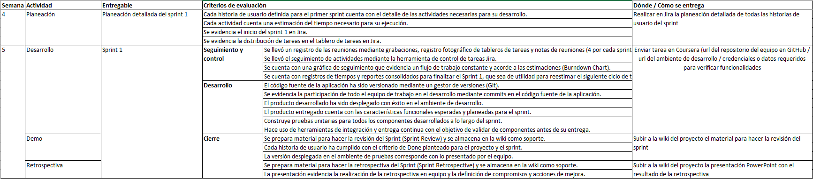

## Sprint 1

### Descripción
---
 
El objetivo del primer sprint es construir las funcionalidades del producto mínimo viable priorizadas por el dueño de producto. Cada equipo debe realizar la planeación detallada con el fin de definir las actividades necesarias para desarrollar cada historia de usuario del *Sprint Backlog*, en el sprint se realiza el diseño, la implementación y las pruebas del sistema. Toda la documentación del proyecto debe organizarse en la wiki de GitHub.

El equipo debe hacer seguimiento a las actividades mediante *daily meetings* y la actualización del tablero de tareas. La actividad de refinamiento del *product backlog* les permitirá avanzar en el detalle de las historias de usuario del siguiente sprint y solucionar dudas sobre las historias que están desarrollando. Finalizando el sprint cada equipo debe preparar la demostración del producto terminado al cliente y los insumos necesarios para realizar la retrospectiva.

<iframe width="968" height="632" src="https://miro.com/app/live-embed/o9J_lH3wguE=/?moveToViewport=-170,-251,1490,1028" frameBorder="0" scrolling="no" allowFullScreen></iframe>

### Entregables y criterios de evaluación
---
 

